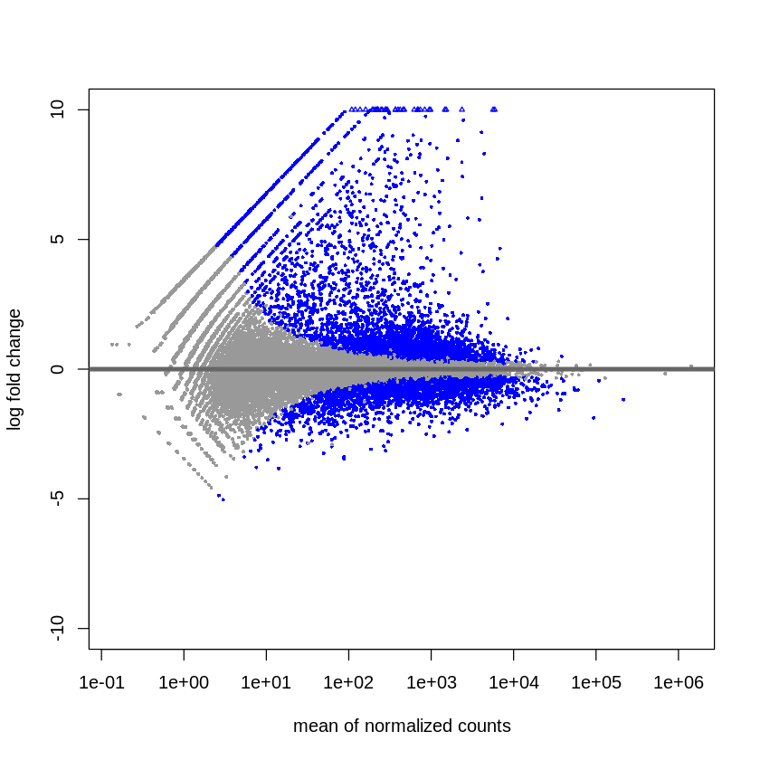

# Bioinformatics Minor - Homework 3

## [Google Colab (ядро Python)](https://colab.research.google.com/drive/1MDoUQhaweCdvfYOyaV3rp6o8NGopVq38?usp=sharing)

## [Google Colab (ядро R)](https://colab.research.google.com/drive/1I_HDWJl80VY-rJQhk-JOXFBfJrrWGPD1?usp=sharing)

## [Полный отчёт multiQC](/data/multiqc_report.html)

#### General Statistics
Sample Name |	% Dups |	% GC |	Length |	% Failed |	M Seqs
-|-|-|-|-|-
SRR3414629_1 |	52.6% |	49% |	65 bp |	18% |	21.1
SRR3414630_1 |	52.7% |	47% |	65 bp |	18% |	15.2
SRR3414631_1 |	54.5% |	49% |	65 bp |	18% |	24.2
SRR3414635_1 | 54.9%	| 49%	| 65 bp |	18% |	21.0
SRR3414636_1 |	54.4% |	49% |	65 bp |	18% |	20.3
SRR3414637_1 | 60.2%	| 47%	| 65 bp |	18% |	20.4

#### Sequence Quality Histograms

#### Per Sequence Quality Scores

#### Per Sequence GC Content

#### Sequence Duplication Levels

#### Status Checks

## Статистика по образцам
ID | Type |	All reads number |	Aligned reads (% of all) |	Aligned 1 time (% of all) |	Reads on genes (% of all)
-|-|-|-|-|-
SRR3414629 |	reprogramming |	21 106 089 |	20 510 113 (97.18 %) |	18 375 888 (87.06 %) |	16 049 609 (76.04 %)
SRR3414630 |	reprogramming |	15 244 711 |	14 832 680 (97.30 %) |	13 186 139 (86.50 %) |	11 465 324 (75.21 %)
SRR3414631 |	reprogramming |	24 244 069 |	23 547 686 (97.13 %) |	20 928 945 (86.33 %) | 18 408 851 (75.93 %)
SRR3414635 | control	| 20 956 475	| 20 395 865 (97.32 %) |	18 428 317 (87.94 %) |	16 275 997 (77.67 %)
SRR3414636 | control |	20 307 147 |	19 757 059 (97.29 %) |	17 825 380 (87.78 %) |	15 757 580 (77.60 %)
SRR3414637 | control	| 20 385 570	| 19 847 291 (97.36 %) |	17 844 858 (87.54 %) |	15 736 978 (77.20 %)

## Plots
MA-plot | Heatmap
-|-
 | 

## Дифференциально экспрессированные гены (примеры)

### Общая информация
ID | Gene |	baseMean  |	log2FoldChange |	lfcSE |	stat |	pvalue | padj
-|-|-|-|-|-|-|-
ENSMUSG00000020758.15 | [Itgb4](http://www.ensembl.org/Mus_musculus/Gene/Summary?db=core;g=ENSMUSG00000020758;r=11:115865535-115899238) |	6336.69 | 4.25983 |	0.114956 |	37.0562 |	1.42866e-300 | 4.10392e-297
ENSMUSG00000037820.15 | [Tgm2](http://www.ensembl.org/Mus_musculus/Gene/Summary?g=ENSMUSG00000037820;r=2:157958322-157988356) |	3906.54 | 4.02391 |	0.110666 |	36.3608 |	1.77307e-289 | 3.24117e-286
ENSMUSG00000026413.12 | [Pkp1](http://www.ensembl.org/Mus_musculus/Gene/Summary?g=ENSMUSG00000026413;r=1:135799133-135846945) |	1670.22 | 5.50794 |	0.162349 |	33.9265 |	2.70764e-252 | 3.40283e-249
ENSMUSG00000074796.10 | [Slc4a11](http://www.ensembl.org/Mus_musculus/Gene/Summary?g=ENSMUSG00000074796;r=2:130526033-130539439) |	890.962 | 4.27569 |	0.135831 |	31.478 |	1.73566e-217 | 1.74504e-214

Itgb4 | Tgm2
-|-
 | 

Pkp1 | Slc4a11
-|-
 | 
